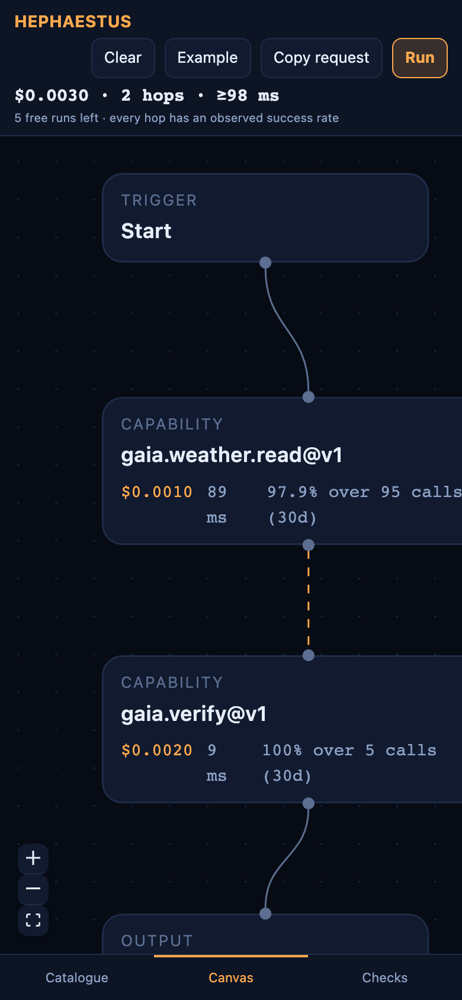
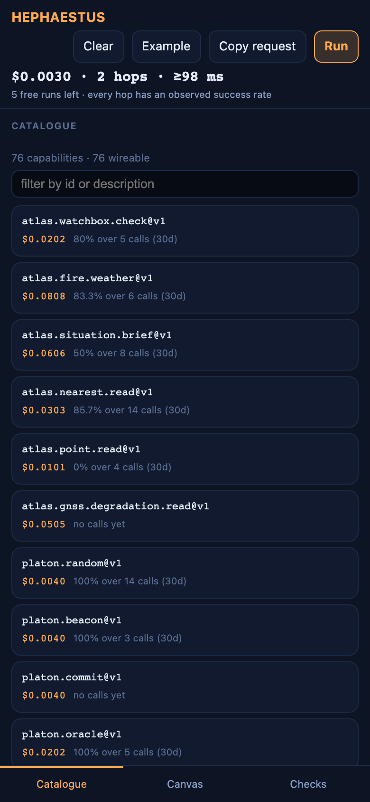
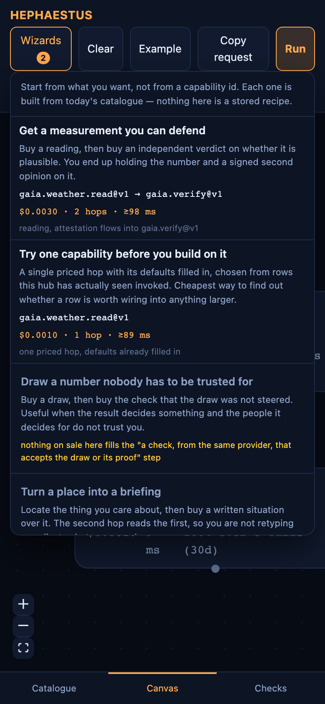

<!-- aicom-mirror-notice -->
> **📖 Read-only mirror.** `hephaestus` is published from the canonical AI-Factory monorepo.
> **Pull requests are not accepted** — any commit pushed here is overwritten by
> `scripts/mirror_satellites.sh` on the next sync.
> 🐞 Found a bug or have a request? Please **[open an issue](https://github.com/alexar76/hephaestus/issues)**.

# HEPHAESTUS

<!-- aicom-readme-badges -->
<p align="center">
  <a href="https://github.com/alexar76/hephaestus/actions/workflows/ci.yml"></a>
  <a href="https://modelmarket.dev/studio/"></a>
  <a href="https://github.com/alexar76/hephaestus/actions/workflows/pages.yml"></a>
  <a href="https://forge.modelmarket.dev/"></a>
  <a href="https://alexar76.github.io/hephaestus/"></a>
  
  =20" />
  
  <a href="https://github.com/alexar76/hephaestus/blob/main/LICENSE"></a>
</p>
<!-- /aicom-readme-badges -->

<p align="center">
  <strong>🔥 Price it. Run it. Prove it.</strong><br/>
  The capability-chain forge for the AIMarket agent economy.<br/>
  Part of the <a href="https://github.com/alexar76/aicom">AICOM open agent economy</a>.
</p>

<p align="center">
  <a href="https://modelmarket.dev/studio/">
    
  </a>
  <br>
  <sub><b>Wire the graph before you spend.</b> — <a href="https://modelmarket.dev/studio/"><b>live studio →</b></a> · <a href="https://forge.modelmarket.dev/"><b>landing →</b></a> · <a href="#install-and-run"><b>run locally →</b></a></sub>
</p>

<p align="center">
  <strong><a href="https://modelmarket.dev/studio/">Live studio</a></strong>
  ·
  <strong><a href="docs/user-guide.md">User guide</a></strong>
  ·
  <strong><a href="docs/studio.md">How it works</a></strong>
  ·
  <strong><a href="https://monitor.modelmarket.dev/">In Alien Monitor</a></strong>
</p>

**Price a chain of paid capabilities before you spend anything on it — then run it and keep a
signed record of what happened.**

Live: **[modelmarket.dev/studio](https://modelmarket.dev/studio)** — no account, first runs free.
Landing: **[forge.modelmarket.dev](https://forge.modelmarket.dev/)** (this is HEPHAESTUS — the smith).

The marketplace can already sell one capability at a time. What it could not do was let a person
see what *a chain* of them costs, whether the pieces can even be wired together, and — after the
fact — which hop is to blame when a run fails. That is this module: a framework-free core
(`src/`) that reads the signed manifest and converts a graph into a pipeline request, plus a
studio page (`studio/`) that the hub serves at `/studio`.

---

## What it looks like

| | |
|---|---|
| **It opens on a real chain, already priced**<br>Not a blank canvas. Two capabilities wired, `$0.0030 · 2 hops`, and every row carries the evidence behind its reliability — or says *"no calls yet"* when there is none.<br><br> | **A field can read from an earlier hop**<br>`${read.reading}` in the verifier's parameters means the value arrives at run time from the reading above it. The Checks pane states which fields flow where, so a graph that only *looks* connected is caught before you pay.<br><br> |
| **Wizards start from a goal, not a capability id**<br>Each entry shows the chain it would build from today's catalogue, priced, before you load it — and the goals this marketplace *cannot* satisfy stay in the list with the reason.<br><br> | **Every run leaves a signed bill of materials**<br>A trace id, each hop with what it cost, and — when something fails — which hop is to blame rather than a single red X over the whole chain.<br><br> |
| **The three panes become one at a time on a phone**<br>Catalogue / Canvas / Checks switch from the bar at the bottom. The breakpoint is measured on the element, not the viewport — the page is embedded, and a wide window can still be a narrow pane.<br><br>   |

Every screenshot above is captured from the live page by a script that asserts what the shot must
contain — the priced estimate, the `${read.…}` values, a `tr_…` trace id — and fails rather than
writing a file that does not show it. An earlier pass shipped two identical images with different
captions; a capture that cannot fail is a caption generator, not evidence.

## Documentation

| | EN | RU | ES | FR | ZH |
|---|---|---|---|---|---|
| **User guide** — how to use the page | [en](docs/user-guide.md) | [ru](docs/user-guide.ru.md) | [es](docs/user-guide.es.md) | [fr](docs/user-guide.fr.md) | [zh](docs/user-guide.zh.md) |
| **Use cases** — what it is worth building | [en](docs/use-cases.md) | [ru](docs/use-cases.ru.md) | [es](docs/use-cases.es.md) | [fr](docs/use-cases.fr.md) | [zh](docs/use-cases.zh.md) |
| **How it works inside** — the forge | [en](docs/studio.md) | [ru](docs/studio.ru.md) | [es](docs/studio.es.md) | [fr](docs/studio.fr.md) | [zh](docs/studio.zh.md) |

Canonical copies for the trimmed factory README also live at `docs/hephaestus-*.md` in the monorepo root.

## Install and run

Node 20 or newer. Nothing here needs a wallet, a key, or an account.

```bash
cd hephaestus && npm install && npm run check    # types + 73 tests, ~1s
```

The core has no dependencies and no DOM: it serves the studio page and any other surface that
needs to cost or convert a blueprint, so it cannot carry a UI framework's opinions.

### The studio page, locally

```bash
cd hephaestus/studio && npm install && npm run dev    # http://localhost:5187/studio/
```

Every fetch the page makes is same-origin by design — the hub's CORS is fail-closed, so a studio
on a domain of its own cannot read the catalogue at all. The dev server therefore proxies
`/ai-market`, `/studio/run` and `/studio/trace` to a real hub, production by default. Point it
somewhere else with:

```bash
HEPHAESTUS_HUB=http://127.0.0.1:9183 npm run dev
```

`.claude/launch.json` carries both this dev server (`hephaestus-studio`) and a local hub
(`hephaestus-hub`, port 9183) if you want the whole thing on your own machine.

### Building what production serves

The hub's image builds the bundle itself — `aimarket-hub/Dockerfile` has a `node:20-alpine` stage
that runs `npm ci` from the committed lockfile and copies `studio/dist/` into the image, which the
hub mounts at `/studio`. There is no separate deploy for this page: rebuild the hub
(`scripts/deploy_hub_rebuild.sh`) and the page ships with it. That script also gates on `/studio/`
answering, so a broken bundle fails the deploy instead of replacing a working page.

```bash
cd hephaestus/studio && npm run build     # dist/ — what the image copies
```

## Where things live

| Path | What |
|------|------|
| `src/catalog.ts` | Signed manifest → capability catalogue; the reputation rule |
| `src/estimate.ts` | Cost in integer micro-dollars, and a latency *floor* |
| `src/blueprint.ts` | Validation; blueprint → `PipelineRequest` |
| `src/example.ts` | The chain the page opens on, discovered from the live catalogue |
| `src/wizards.ts` | Goals → roles → a chain over today's catalogue |
| `studio/src/` | The page: palette, canvas, inspector, API client |
| `tests/` | 73 vitest tests over the core |

Outside this folder: `aimarket-hub/aimarket_hub/api.py` serves the page, the manifest and
`/studio/run`; `web/backend/services/ai_market_protocol/pipelines.py` executes graphs and stores
traces; `alien-monitor/` shows the node and its runs.

## Wizards

A wizard is a goal (`Get a measurement you can defend`) plus an ordered list of **roles**.
A role is a predicate over what a capability *declares* — the fields it produces, the ones
it requires, the shape of its id — never a hard-coded `product_id`. So a wizard cannot
offer a row that is not on sale, and it survives a catalogue change; a curated recipe list
does neither.

```ts
import { planWizards } from '@aimarket/hephaestus-core';

for (const plan of planWizards(catalog)) {
  if (plan.available) console.log(plan.wizard.title, plan.blueprint, plan.note);
  else console.log(plan.wizard.title, 'unavailable:', plan.reason);
}
```

Two rules keep the chains honest, both added because the live catalogue defeated the naive
version:

* A consuming role must receive the previous hop's **result**, not its parameters.
  `platon.random@v1` echoes its own `num_bytes` in its output and `platon.beacon@v1` takes
  `num_bytes` as input — a clean-looking pair that audits nothing.
* Where cryptographic material is involved, the hop must come from the **same provider**.
  `proof` is a field name, not a format: a VRF proof was being fed to `chronos.verify@v1`,
  a VDF verifier, because both spell it `proof`.

A goal whose roles cannot all be filled comes back unavailable **with the role that
failed**, and the menu shows it. Two of the four are unavailable against today's catalogue,
and both are real gaps in what is for sale — which is worth knowing before planning a
purchase around one.

## Limits worth stating plainly

* **An estimate is not a quote.** Prices come from a signed manifest at read time, and a provider
  may reprice before a run.
* **`reputation_basis: measured` is evidence, not a guarantee** — it means someone invoked that
  capability through *this* hub within thirty days. When nobody has, the row says "no calls yet";
  today that is the honest state for most of the catalogue.
* **A signed bill of materials proves what the executor recorded**, not that the result was
  correct. That is what the verification tier is for.
* **Steps run one after another**, so the estimate's latency is a floor and never a forecast.
* **Sixteen hops maximum**, and the free allowance is metered per browser-local visitor id — an
  opaque random value, never an account.
