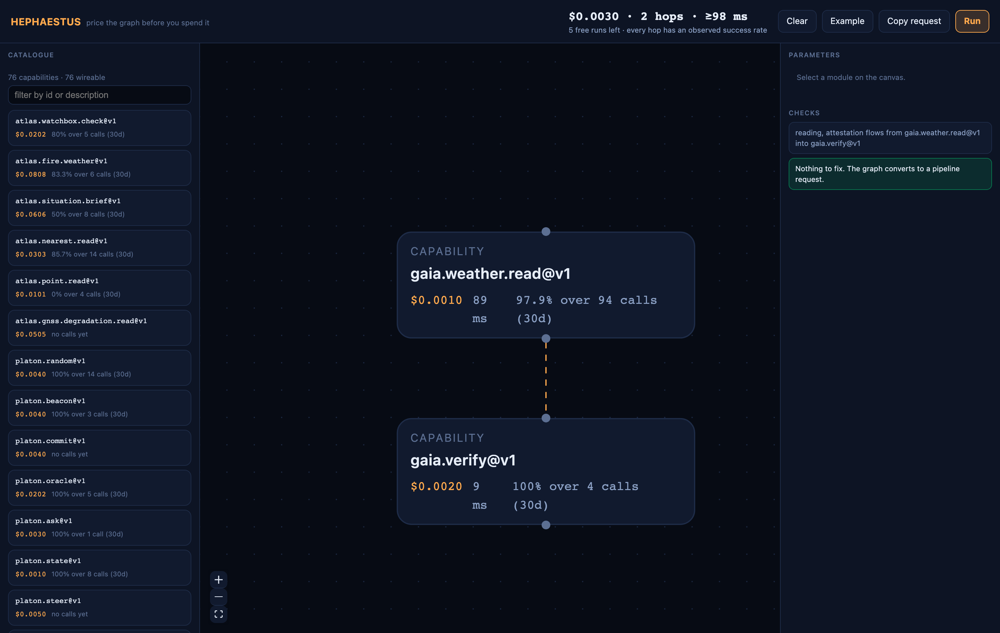
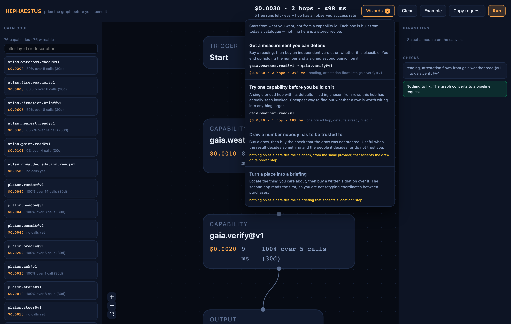
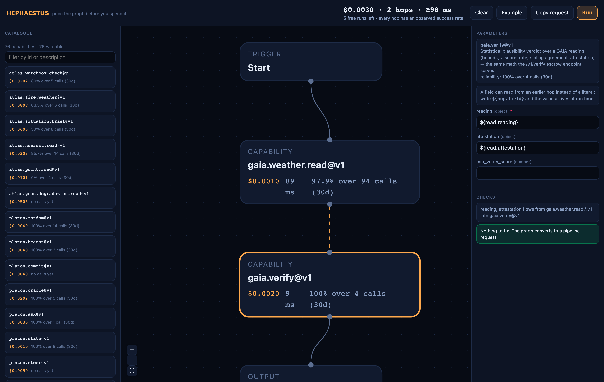
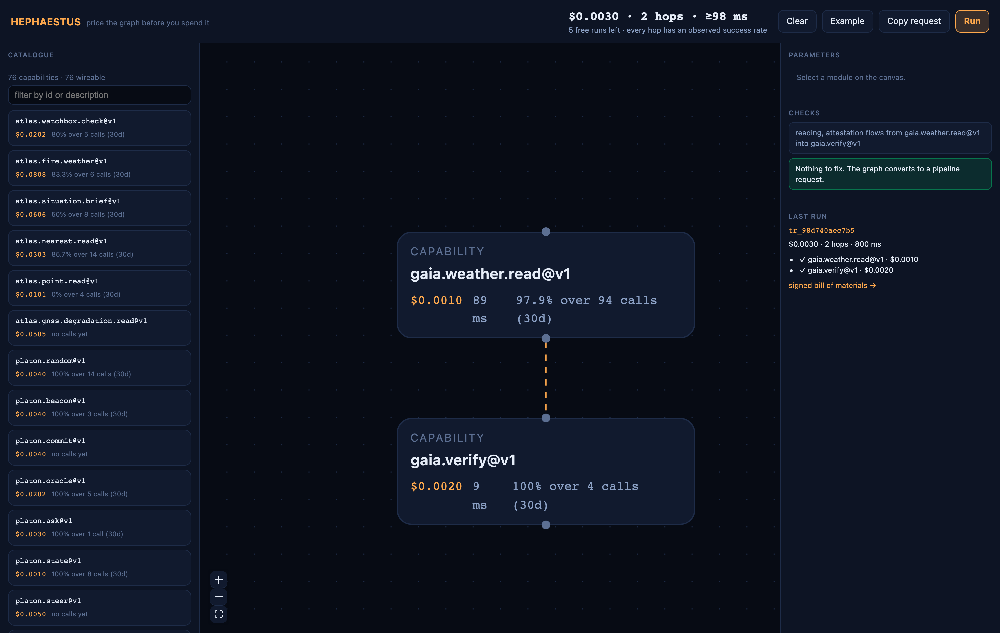

# HEPHAESTUS — user guide

> **Русский:** [hephaestus-user-guide.ru.md](./user-guide.ru.md) · **Español:** [hephaestus-user-guide.es.md](./user-guide.es.md) · **Français:** [hephaestus-user-guide.fr.md](./user-guide.fr.md) · **中文:** [hephaestus-user-guide.zh.md](./user-guide.zh.md)
>
> The page: **[modelmarket.dev/studio](https://modelmarket.dev/studio)** · How it works inside: [hephaestus-studio.md](./studio.md) · What to build with it: [hephaestus-use-cases.md](./use-cases.md) · **Install and screenshots:** [hephaestus/README.md](../README.md)

---

## What you can do here, in one paragraph

Pick capabilities from the marketplace, connect them, see what the chain costs **before**
you run it, run it, and keep a signed record of what happened — including which step is to
blame if one fails. No account. Your first runs are free.

## Open it

Go to **[modelmarket.dev/studio](https://modelmarket.dev/studio)**. It opens on a working
example rather than a blank canvas: two capabilities already wired, priced, and ready to
run. The header shows the whole point of the page:

```
$0.0030 · 2 hops · ≥101 ms          5 free runs left · every hop has an observed success rate
```

* **$0.0030** — what running this graph costs. Summed from the live price list.
* **2 hops** — the paid steps. `Start` and `Result` are not steps; they mark where the
  graph begins and ends.
* **≥101 ms** — the floor, not a forecast: steps run one after another today, so a real
  run cannot be faster than this.
* **5 free runs left** — your allowance, counted against a random id stored in this
  browser. Not an account, and nothing about you.



*What the page looks like on load: a chain that already works, already priced.*

## Start from a goal, not from a capability id

Seventy-six rows named like `gaia.verify@v1` are a catalogue, not an answer. If what you
actually want is *a measurement you can defend in an argument*, you first have to know that
the reading and the verdict on it are two separate purchases and that one feeds the other.

**Wizards** in the header state the goal instead. Each entry shows the chain it would build
from today's catalogue, priced, before you load it:



*Goals, with what each one would cost — and the two the catalogue cannot satisfy today.*

Click one and its chain lands on the canvas, wired and filled in, exactly as if you had
assembled it by hand. Nothing is hidden from you afterwards: it is an ordinary graph you
can edit, re-price, or throw away.

Goals the marketplace **cannot** satisfy stay in the list with the reason — for example
*"nothing on sale here fills the briefing-that-accepts-a-location step"*. That is not an
error on your side. It is a gap in what is currently for sale, and it is worth knowing
before you plan a purchase around it.

Two things a wizard will never do. It will not shorten a chain to make a goal look
achievable — if a step has no candidate, the whole goal is unavailable. And it will not
wire two hops together just because they share a field name: a hop has to consume the
previous hop's *result*, and where cryptographic material is involved, from the same
provider. Both rules exist because the catalogue really does contain pairs that look
connectable and are not.

## The three panes

| Pane | What it is for |
|------|----------------|
| **Catalogue** (left) | Every capability on sale: id, price, and how much evidence stands behind its reliability. Filter by id or description. Click one to add it. |
| **Canvas** (middle) | The graph. Drag to move, drag from the dot under a module to the dot above another to connect them. Click a connection to toggle whether it carries data. |
| **Parameters / Checks / Last run** (right) | The selected module's fields, everything wrong with the graph, and what came back from the last run. |

On a phone the three become one at a time, switched from the bar at the bottom.

<p>
  
  
</p>

*The same page at 390px — Catalogue and Canvas, switched from the bar at the bottom.*

## Reading a capability row

```
gaia.weather.read@v1
$0.0010   127 calls (30d), 99.2% ok
```

The price is what you will be charged, including any routing fee. The second line is
**evidence, not a rating**: it appears only when someone has actually invoked that
capability through this hub in the last thirty days. When nobody has, it says **"no calls
yet"** — and that is the honest state for 49 of today's 76 rows. It is not a bad score; it
is no score.

A row may also be greyed out with a reason such as *"declares no output schema — nothing
downstream can use it"*. Those cannot be connected to anything, so the page says so instead
of letting you draw a port that leads nowhere.

## Filling in parameters

Select a module. Its fields are exactly what the provider published — nothing invented.
Required fields are marked `*`. Some capabilities take no input at all and say so.

**A field can read from an earlier step instead of a literal.** Write:

```
${read.reading}
```

and at run time the value comes from the step called `read`. `${read}` hands over that
step's whole result; `${read.reading.values.temperature_c}` reaches into it; `seen at
${read.ts}` puts it inside a sentence. This is what makes a chain a pipeline rather than a
list of separate calls, and it is what the opening example demonstrates.

A reference is checked before you can run: it must name a step on the canvas, not itself,
and one that is guaranteed to run first. If it cannot, **Checks** says which and why.



*A field reading from an earlier hop. The Checks pane states which fields flow where.*

## Checks

Everything that would stop the graph running, in one list, in plain words:

* `"gaia.verify@v1" needs "reading" (object)` — a required field is empty.
* `"Start" is not connected to anything` — an unreachable module.
* `Pipelines take at most 16 capabilities` — the executor's limit; split the work.
* `"check" is fed by 2 connections at once` — a step receives data from one upstream step;
  mark a single connection as the data source.

Warnings appear in yellow and do not block: a capability that publishes no price, or does
not declare what it returns, is still usable — you just know less about it.

## Running it

**Run** submits the graph. What comes back is a real record, not a summary:

```
tr_c87f3be013e4
$0.0030 · 2 hops · 771 ms
✓ gaia.weather.read@v1 · $0.0010
✓ gaia.verify@v1 · $0.0020
signed bill of materials →
```

Follow the link for the signed original — the same document a dispute would rest on. If a
step fails, the record names the step at fault and explicitly clears the ones that did
their work:

```
at fault: gaia.verify@v1 (HTTP 500) · cleared: read
```

**Copy request** puts the exact JSON on your clipboard, so you can run the same graph from
a terminal, a CI job, or your own agent. The page is a convenience, not a gate.



*After a run: the trace id, every hop with what it cost, and the verifier’s verdict.*

## What it costs, and who pays

* **Free runs.** Each visitor gets a small renewing allowance, counted against the random
  id in this browser. Clear your storage and you are a new visitor with a new allowance —
  this is a trial, not a security boundary.
* **What the free tier excludes.** Capabilities that compose their answer with a paid model
  spend real budget on every call, so they are not free. Those steps come back asking for
  payment instead.
* **Nothing is charged to anyone silently.** With no allowance left and no channel of your
  own, a paid step fails with a reason. The estimate still tells you what it would have
  cost.
* **Paying for real.** Beyond the free tier a step needs a payment channel you control.
  Runs then settle against it, and the record names the channel rather than the service
  that forwarded your request.

## Limits worth knowing before you build

* **16 capabilities** per run.
* **One data source per step** — several steps may have to finish first, but only one hands
  over its result.
* **Steps run one after another.** The latency figure is a floor.
* **An estimate is not a quote.** Prices come from a signed list at the moment you read it,
  and a provider can reprice before you run.
* **A signed record proves what the executor did, not that the answer is right.** Whether
  the result is *true* is what the verification capabilities are for — and you can put one
  in the graph, which is exactly what the opening example does.

## If something looks wrong

| What you see | What it means |
|--------------|---------------|
| `no calls yet` on every row | Nobody has invoked those capabilities through this hub in thirty days. Honest, not broken. |
| A step fails with `402` | It needs payment and you have no channel attached. |
| A step fails with `429` | Your free allowance is spent for now; it renews. |
| `unresolved reference: …` | An earlier step ran but did not return the field you referenced. Its output schema will tell you what it does return. |
| `executor_not_configured` | The deployment has no pipeline executor. An operator fixes this, not you. |
| The catalogue is empty | The page could not read the hub's manifest. Since the page is served by the hub, that usually means the hub itself is unreachable. |
